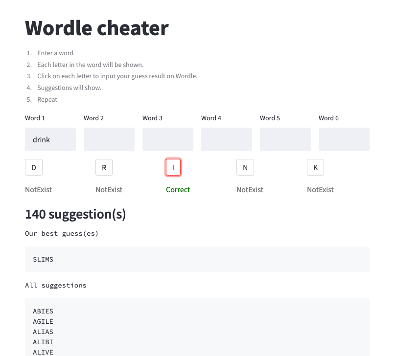
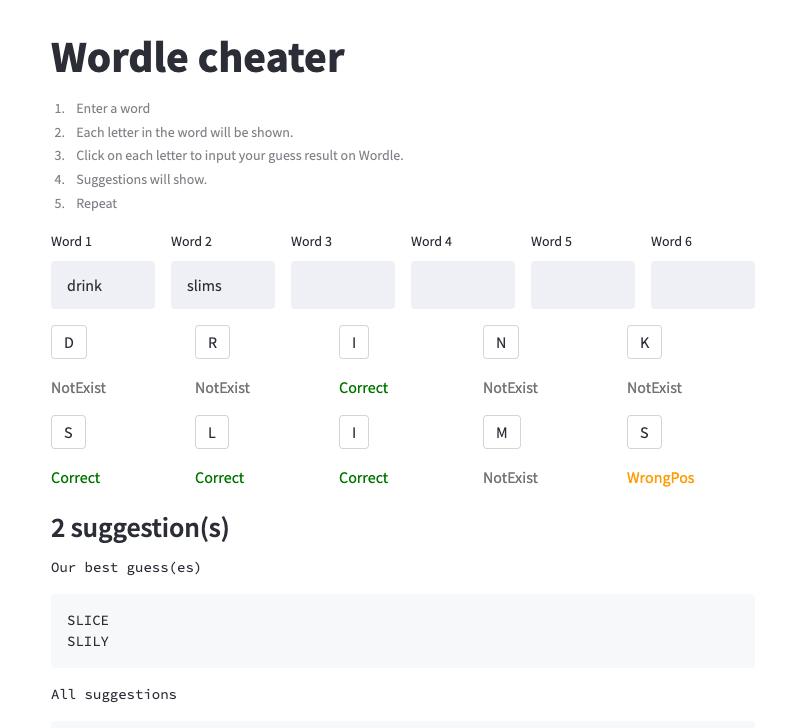

# Wordle Cheater

Struggling with [Wordle](https://www.nytimes.com/games/wordle/index.html)? Let's shamelessly cheat.

# Usage
Follow the instructions. Suppose we're going for `SLICE`.

1. `DRINK` for the first attempt.

   
2. Didn't work. Try the suggested `SLIMS`.

   
3. Here come `SLICE`.

# Running
```shell
$ streamlit run cheater.py
```

# Note
I'm not handling errors. Make sure you stick to Wordle rules.

# Special thanks
Thanks [http://www.mieliestronk.com/wordlist.html](http://www.mieliestronk.com/wordlist.html) for the vocab list.